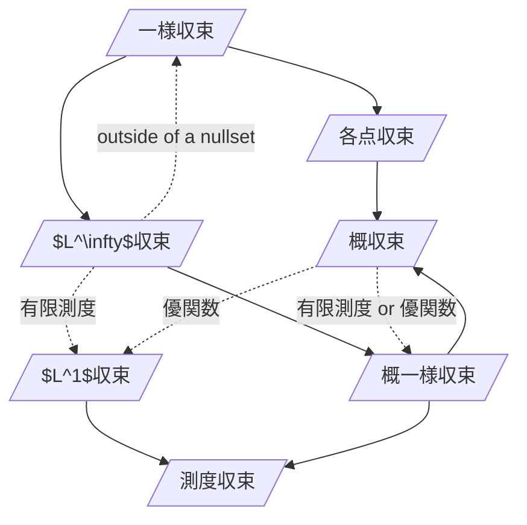

```mermaid
graph TD
    A[/一様収束/] --> B[/各点収束/] --> C[/概収束/]
    A --> D[/ $L^\infty$収束 /] --> E[/概一様収束/]
    D -. 有限測度 .-> F[/$L^1$収束/] --> G[/測度収束/]
    E --> C
    C -. 有限測度 or 優関数 .-> E
    E --> G
    C -. 優関数 .-> F
    D -. outside of a nullset .-> A
```