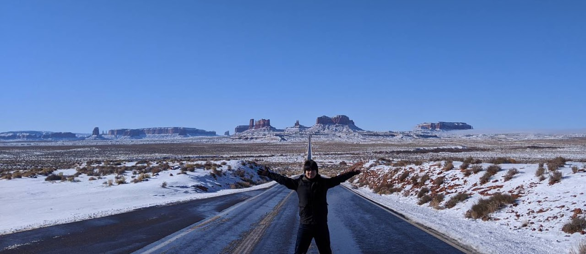

# Ryosuke Yoneda’s Homepage

My name is Ryosuke Yoneda.
I studied informatics at Kyoto University and conducted theoretical and experimental research on coupled phase-oscillator models.
After obtaining my Ph.D., I joined the data science department of Nomura Securities.
I am currently engaged in tasks related to financial data analysis and machine learning applications.
I am interested in mathematical models and network science, and I want to understand the dynamics of complex systems in nature and social phenomena.
My hobbies are reading and programming.
Nice to meet you!!

- [:fontawesome-solid-house-chimney: **Homepage**](https://yonesuke.github.io/)
- [:fontawesome-solid-paper-plane: **E-mail**](mailto:yonedakyoto@gmail.com)
- [:fontawesome-brands-github: **GitHub**](https://github.com/yonesuke)
- [:fontawesome-brands-twitter: **Twitter**](https://twitter.com/yonesuke1729)
- [:fontawesome-brands-google-scholar: **Google Scholar**](https://scholar.google.com/citations?user=XN3JxqIAAAAJ)

