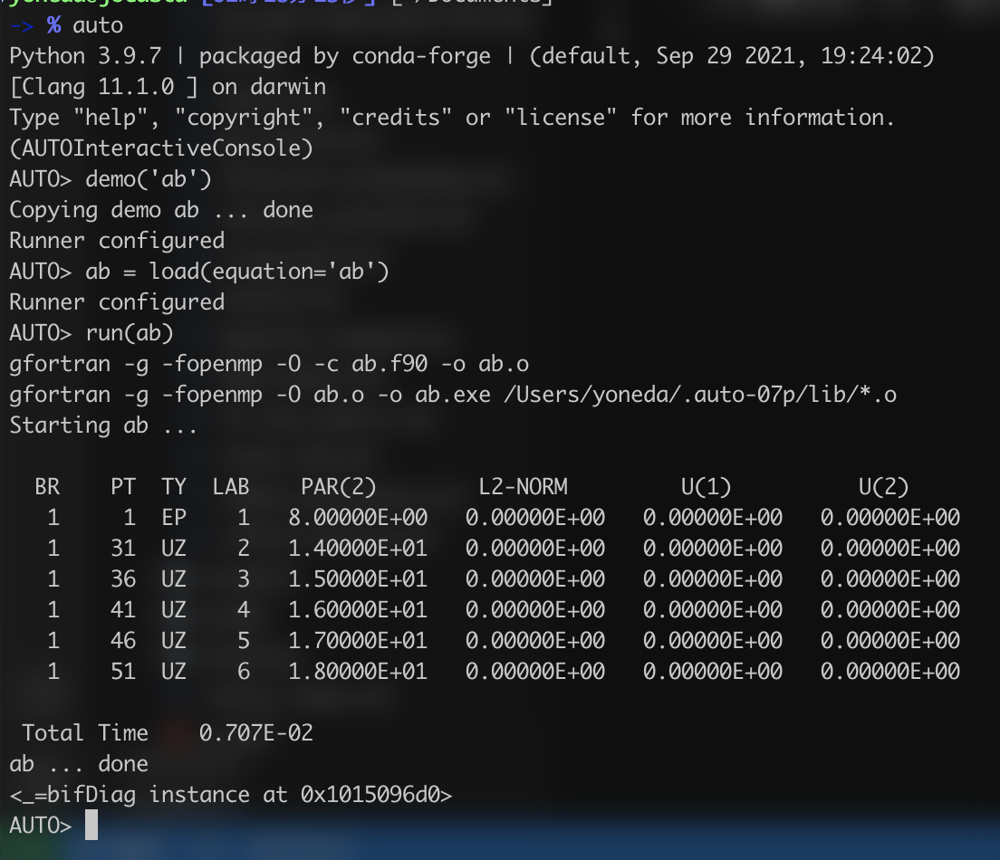

AUTOはODE(常微分方程式)の分岐解析を扱うソフトウェアで、1980年に開発されて以来力学系界隈で使われてきました。
現在はGitHubにてコードが公開されて細々と(?)開発が続けられています。

- https://github.com/auto-07p/auto-07p

AUTOは便利ではあるのですが、そのインストール方法がプログラム初心者には少し難しいことがあるそうなのでその流れを少しまとめてみました。
以下では基本的にMac OSでインストールする方法を述べますが、WindowsやLinuxでも同様だと思います。
また、最低限のターミナルでの操作は出来るものとしておきます。

<!-- more -->

## インストール方法
- はじめにGitHubからコードをダウンロードする必要があります。これには、リポジトリをcloneする方法とリリースからダウンロードをする方法があります。
cloneという言葉の意味がわからなければリリースからダウンロードする方が良いかもしれません。
    - GitHubからAUTOのリポジトリをcloneする場合は次のコマンドを打ち込みます。
        ```bash
        git clone git@github.com:auto-07p/auto-07p.git
        ```
        次にこのフォルダをホーム直下で`~/.auto-07p`という名前で移動させましょう。
        ```bash
        mv auto-07p ~/.auto-07p
        ```
        この場所が嫌ならば他の場所に他の名前で移動させてもらっても構いません。その場合は後で編集する`auto.env.sh`も適切に変えてください。
    - GitHub内のリリースページ内にある最新のリリースから`Source code (zip)`をダウンロードしてください。記事作成時点ではバージョン`0.9.3`が最新でした。例えば`Downloads`フォルダ内にzipファイルが格納されたとしましょう。このフォルダを開いてzipファイルを展開してください。同一フォルダ内で`auto-07p-0.9.3`というフォルダが作られるはずです(後ろの数字はバージョンを表すので変動する可能性はあります)。次にターミナルを開いて次のコマンドを打ち込んでください。
        ```bash
        mv ~/Downloads/auto-07p-0.9.3 ~/.auto-07p
        ```
        上に同じですが、この場所が嫌ならば他の場所に他の名前で移動させてもらっても構いません。

- このフォルダ内に移動しておきます。
    ```bash
    cd ~/.auto-07p
    ```
- フォルダ内で`./configure`を実行した上で`make`を行います。
    ```bash
    ./configure
    make
    ```
    何も問題がなければこの`make`は成功しますが、うまくAUTOが起動出来ない場合はこの`make`で失敗している可能性が高いです。エラーが出ていないかはよく見ておいてください。
- あとはAUTOの設定ファイルをシェルに読み込ませるだけですが、GitHubからcloneしたファイルに間違いがあるので修正する(間違っているというか、リリースされているもののフォルダ構成がGitHubのフォルダ構成と微妙に違うだけ、ではあります)。`~/.auto-07p/cmds/auto.env.sh`の5行目を次のように編集してください。
    ```diff
    -AUTO_DIR=$HOME/auto/07p
    +AUTO_DIR=$HOME/.auto-07p
    ```
    このとき`~/.auto-07p`以外にフォルダを設置している場合はそのように`AUTO_DIR`を設定しておいてください。
    最終的に`~/.auto-07p/cmds/auto.env.sh`は次のようになります。
    ```bash
    #
    #  This file has to be sourced before activating AUTO if you are using
    #  a 'sh' compatible shell, such as sh, bash, ksh, or ash.
    #
    AUTO_DIR=$HOME/.auto-07p
    PATH=$AUTO_DIR/cmds:$AUTO_DIR/bin:$PATH
    # the following is an example (to be uncommented) for Windows+MSYS:
    #PATH="/c/Python27:/bin:/c/Program Files/gfortran/bin:$PATH"
    export AUTO_DIR
    export PATH
    #
    # DON'T ADD ANYTHING AFTER THIS LINE
    #
    ```
    この設定ファイルをシェルに読み込ませればおしまいです。
    ```bash
    source ~/.auto-07p/cmds/auto.env.sh
    ```
- 実はこの方法だとターミナルを立ち上げるたびに設定ファイルの読み込みコマンドを打ち込む必要があるため面倒です。ターミナルを立ち上げるたびにシェルの設定ファイルが読み込まれるのでそこに上のコマンドを追記しましょう。使っているシェルがZSHなら`.zshrc`に、BASHなら`.bashrc`に、一番最後の行に次を追記してください。(自分で設定ファイルを色々と編集している方は適切な場所に書いてもらって構いません。)
    ```bash
    source ~/.auto-07p/cmds/auto.env.sh
    ```
- これで設定は完了です。一度ターミナルを閉じてもう一度立ち上げ直したあと、`auto`と打ち込んで次のようにdemoを動かせたら成功です！！
    
