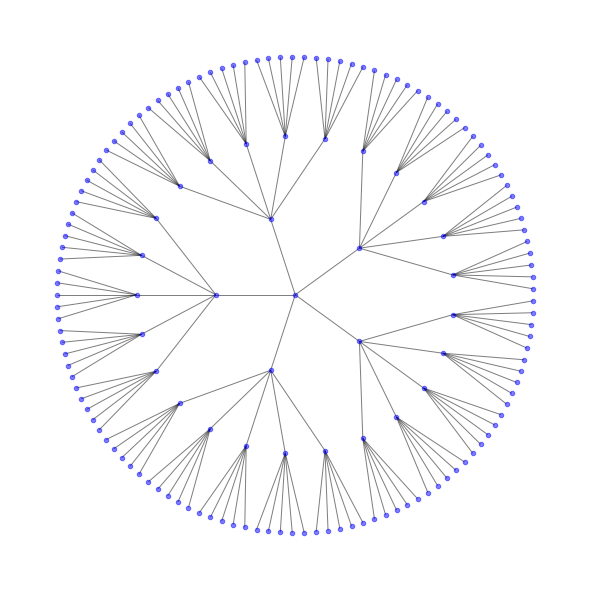

Baxterの本にベーテ格子上のイジングモデルの話があって面白かったのでまとめてみます。臨界点と臨界指数を求めるところまで書いてみます。

## Bethe lattice

ベーテ格子は無限サイズのグラフの一つで、統計力学において厳密に解ける模型としてしばしば登場するものです。
具体的には次のように構成します。

- 中心の点からスタートとして$q$個の点と枝を繋ぐ。中心の点を$0$番目の殻、それと繋がる点を$1$番目の殻に属すると呼ぶ。
- $r$番目の殻まで構成したとき、その殻に属するそれぞれの点から$q-1$個の点と枝を繋ぎ、この点を$r+1$番目の殻とする。

この操作を無限に繰り返すことでベーテ格子が構成されます。例えば$q=$5として3番目の殻までプロットしたものは次のようになります。

## Ising model
統計力学の細かい話はここでは述べません。定義だけさらっとまとめていきます。イジングモデルのエネルギーは、
$$
H(\bm{\sigma})=-J\sum_{\langle i,j\rangle}\sigma_{i}\sigma_{j}-H\sum_{i}\sigma_{i}
$$
で与えられ、$\bm{\sigma}$の確率分布は
$$
P(\bm{\sigma})=\exp(-H(\bm{\sigma})/k_{B}T)=\exp\left[K\sum_{\langle i,j\rangle}\sigma_{i}\sigma_{j}+h\sum_{i}\sigma_{i}\right]
$$
になります。$\bm{\sigma}$の各要素は$\pm1$の値を取ります。
$\langle i,j\rangle$はベーテ格子上の隣接する点を集めたものです。
$k_{B}$はボルツマン定数であり、$K=J/k_{B}T,h=H/k_{B}T$と置いています。
この分布は規格化されていません。規格化定数が分配関数でこれは$Z=\sum_{\bm{\sigma}}P(\bm{\sigma})$になります。
適当な物理量は確率分布をもとに計算されます。例えば中心の磁化を$\sigma_{0}$と置くとその値は
$$
M=\langle\sigma_{0}\rangle=\frac{1}{Z}\sum_{\bm{\sigma}}\sigma_{0}P(\bm{\sigma})
$$
で与えられます。次のセクションで$M$の値を実際に計算していきます。

## Recurrence relation

ベーテ格子の対称性から中心の点はは$q$個の同一の部分木に分けられます。$j$番目の部分木の点集合を$s^{(j)}$と置くと確率分布は、
$$
P(\bm{\sigma})=\exp(h\sigma_{0})\prod_{j=1}^{q}Q_{n}(\sigma_{0}\mid s^{(j)})
$$
で書けます。ここで、
$$
Q_{n}(\sigma_{0}\mid s) = \exp\left[K\sum_{\langle i,j\rangle}s_{i}s_{j}+Ks_{1}\sigma_{0}+h\sum_{i}s_{i}\right]
$$
は$\sigma_{0}$と木$s$との接続が寄与する項を表します。そのため和を取る項はすべて$s$内のものになります。
添字$n$はこの段階では$n$番目の殻まで打ち切ったベーテ格子を考えていることから来るものです。このあとで$n\to\infty$の極限を考えます。

これをもとに中心の磁化$M$を計算します。$Q_{n}$を部分木上で和を取ったものを$g_{n}$と置くことにします。すなわち、
$$
g_{n}(\sigma_{0})=\sum_{s}Q_{n}(\sigma_{0}\mid s)
$$
です。各部分木上で$g_{n}$の値が一致することを用いると、
$$
\begin{align*}
M=&Z^{-1}\sum_{\sigma_{0}}\sigma_{0}\exp(h\sigma_{0})[g_{n}(\sigma_{0})]^{q}=Z^{-1}\left(e^{h}[g_{n}(+1)]^{q}-e^{-h}[g_{n}(-1)]^{q}\right)\\\\
Z=&\sum_{\sigma_{0}}\exp(h\sigma_{0})[g_{n}(\sigma_{0})]^{q}=e^{h}[g_{n}(+1)]^{q}+e^{-h}[g_{n}(-1)]^{q}
\end{align*}
$$
になります。ここで、$x_{n}=g_{n}(-1)/g_{n}(+1)$と置くと、
$$
M=\frac{e^{h}-e^{-h}x_{n}}{e^{h}+e^{-h}x_{n}}
$$
が得られます。

$x_{n}$は$n$に依存するので、$n$に関する漸化式を求めてみましょう。$Q_{n}$を構成する部分木$s$はそれ自身$q-1$個の部分木を含みます。なので、$Q_{n}$はさらなる分解が期待されます。
$$
Q_{n}(\sigma_{0}\mid s)=\exp(K\sigma_{0}s_{1}+hs_{1})\prod_{j=1}^{q-1}Q_{n-1}(s_{1}\mid t^{(j)})
$$
ここで、$s_{1}$は部分木$s$の根であり、$t^{(j)}$は$s_{1}$に接続する$j$番目の部分木になります。
この式を部分木$s$上で和を取って見ましょう。特に、右辺は$s_{1}$と$t^{(j)}$上の和に分解してみると、
$$
\begin{align*}
g_{n}(\sigma_{0})=&\sum_{s_{1}}\exp(K\sigma_{0}s_{1}+hs_{1})[g_{n-1}(s_{1})]^{q-1}\\\\
=&\exp(K\sigma_{0}+h)[g_{n-1}(+1)]^{q-1}+\exp(-K\sigma_{0}-h)[g_{n-1}(-1)]^{q-1}
\end{align*}
$$
になるので、$x_{n}$については
$$
\begin{align*}
x_{n}=&\frac{g_{n}(-1)}{g_{n}(+1)}\\\\
=&\frac{\exp(-K+h)[g_{n-1}(+1)]^{q-1}+\exp(K-h)[g_{n-1}(-1)]^{q-1}}{\exp(K+h)[g_{n-1}(+1)]^{q-1}+\exp(-K-h)[g_{n-1}(-1)]^{q-1}}\\\\
=&\frac{e^{-K+h}+e^{K-h}x_{n-1}^{q-1}}{e^{K+h}+e^{-K-h}x_{n-1}^{q-1}}
\end{align*}
$$
が得られます。

## Critical point
上の結果をまとめると、$x_{n}$は次のベクトル場
$$
F(x)=\frac{e^{-K+h}+e^{K-h}x^{q-1}}{e^{K+h}+e^{-K-h}x^{q-1}}
$$
で定まる離散力学系です($x_{n+1}=F(x_{n})$)。特に境界ではその先に繋がる点が存在しないため、$x_{0}=1$です。
なので基本的に考えるべきことは、$x_{n+1}=F(x_{n})$の安定平衡点を求めることです。その平衡点を$x_{\ast}$として$M$に代入することで磁化が求まります。

臨界点は外力$h=0$のもとで自発磁化$M\ne0$が発生する点として特徴づけられます。
このとき逆温度$K$によらずに$F(1)=1$の固定点が存在して対応して$M=0$になります。なので、$x=1$の安定性が切り替わるところ、すなわち
$$
\frac{dF}{dx}(1)=1
$$
となる点$K_{\mathrm{c}}$が臨界点に対応します。これを解くことで、
$$
K_{\mathrm{c}}=\frac{J}{k_{B}T_{\mathrm{c}}}=\frac{1}{2}\log\left(\frac{q}{q-2}\right)
$$
が得られます。これがベーテ格子上のイジングモデルの臨界点になります。

## Critical exponents
$\beta=1/2,\gamma=1,\delta=3$

## グラフ