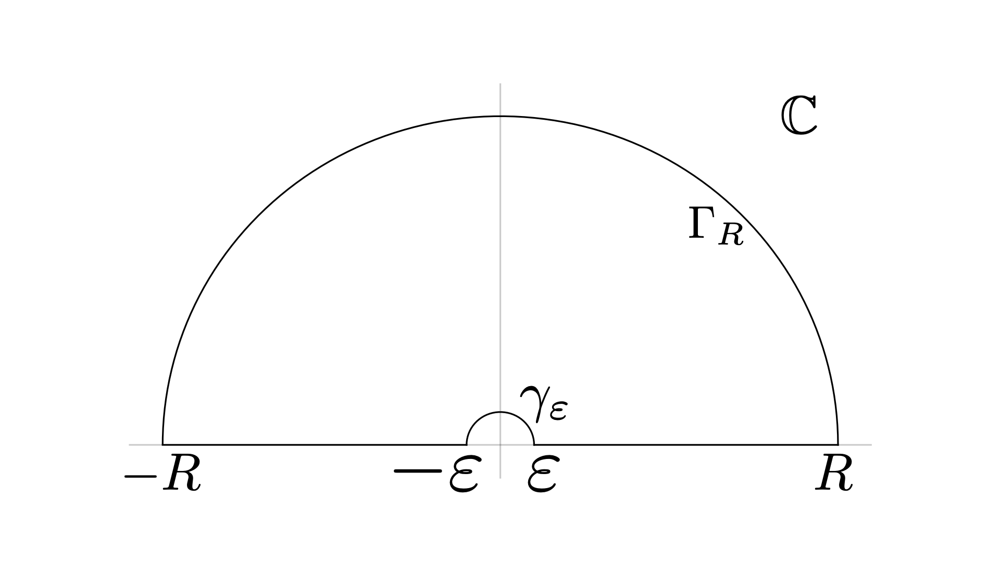

Borwein積分は$\sin x/x$に関する興味深い性質を持った積分のことです。
例えば
$$
\int_{0}^{\infty}\frac{\sin x}{x}dx=\frac{\pi}{2}
$$
となることはよく知られていますが、これに$\sin(3x)/3x$をかけたものについても
$$
\int_{0}^{\infty}\frac{\sin x}{x}\frac{\sin (x/3)}{x/3}dx=\frac{\pi}{2}
$$
が成り立ちます。同様のことは$\sin (x/5)/(x/5)$や$\sin(x/7)/(x/7)$をかけていっても成り立ち、
$$
\int_{0}^{\infty}\frac{\sin x}{x}\frac{\sin (x/3)}{x/3}\cdots\frac{\sin (x/13)}{x/13}dx=\frac{\pi}{2}
$$
となります。しかし、次のステップではこの計算は崩れて
$$
\int_{0}^{\infty}\frac{\sin x}{x}\frac{\sin (x/3)}{x/3}\cdots\frac{\sin (x/15)}{x/15}dx=\frac{467807924713440738696537864469}{935615849440640907310521750000}\pi<\frac{\pi}{2}
$$
となってしまいます。一見するとこの値も$\pi/2$になりそうなのですが、何故か値がずれてしまいます。
このような積分のことをBorwein積分とよび、いくつかの計算がなされています。

<!-- more -->

## 公式
数列$a_{1},a_{2},\dots,a_{n}$に対して、Borwein積分$\tau_{n}$を
$$
\tau_{n}=\int_{0}^{\infty}\prod_{k=1}^{n}\frac{\sin(a_{k}x)}{a_{k}x}dx
$$
で定めます。ここでは各$a_{i}$は正だとしておきます。この積分は完全に計算することができて、
$$
\tau_{n}=\frac{\pi}{2^{n+1}(n-1)!\prod_{k=1}^{n}a_{k}}\sum_{p_{1},\dots,p_{n}=\pm1}p_{1}\cdots p_{n}\mathrm{sgn}\left(\bm{p}\cdot\bm{a}\right)(\bm{p}\cdot\bm{a})^{n-1}
$$
となります。以下でこれを示していきます。元論文ではFourier変換による畳込み積分を用いて計算していますが、留数定理を用いた計算でも示すことができたのでそれを紹介していきます。

## 証明
はじめに$\sin(a_{k}x)$を展開していきます。
$$
\tau_{n}=\int_{0}^{\infty}\prod_{k=1}^{n}\frac{\sin(a_{k}x)}{a_{k}x}dx
=\frac{1}{(2i)^{n}\prod_{k=1}^{n}a_{k}}\int_{0}^{\infty}\frac{\prod_{k=1}^{n}(e^{ia_{k}x}-e^{-ia_{k}x})}{x^{n}}dx
$$
です。ここでパラメーター$p_{k}=\pm1$を導入して$e^{ia_{k}x}-e^{-ia_{k}x}=\sum_{p_{k}=\pm1}p_{k}e^{ip_{k}a_{k}x}$と書くと、
$$
\prod_{k=1}^{n}(e^{ia_{k}x}-e^{-ia_{k}x})=\sum_{p_{1},\dots,p_{n}=\pm1}p_{1}\cdots p_{n}e^{i\bm{p}\cdot\bm{a}x}
$$
となるので、
$$
\tau_{n}=\frac{1}{(2i)^{n}\prod_{k=1}^{n}a_{k}}\sum_{p_{1},\dots,p_{n}=\pm1}p_{1}\cdots p_{n}\int_{0}^{\infty}\frac{e^{i\bm{p}\cdot\bm{a}x}}{x^{n}}dx
$$
となります。

よって、$\int_{0}^{\infty}e^{iax}/x^{n}dx$が計算できれば良いです。
$a>0$の場合を考えます。
被積分関数を複素平面に持ち上げて
$$
f(z)=\frac{e^{iaz}}{z^{n}}
$$
とします。このとき、次のような積分経路$C$を考えます。



$\gamma_{\varepsilon}$は半径$\varepsilon$の円の上半面を時計回りに回る経路で、$\Gamma_{R}$は半径$R$の上半面を反時計回りに回る経路です。
$f(z)$は$C$内で正則なので$\oint_{C}f(z)dz=0$です。
また、
$$
\oint_{C}=\int_{-R}^{-\varepsilon}+\int_{\gamma_{\varepsilon}}+\int_{\varepsilon}^{R}+\int_{\Gamma_{R}}
$$
です。

- 経路$\Gamma_{R}$について、$\theta\colon0\to\pi$に対して$z=Re^{i\theta}$とすると、
    $$
    \left|\int_{\Gamma_{R}}f(z)dz\right|=\left|\int_{0}^{\pi}\frac{e^{iaRe^{i\theta}}}{R^{n}e^{in\theta}}Rie^{i\theta}d\theta\right|\leq2R^{-n+1}\int_{0}^{\pi/2}e^{-aR\sin\theta}d\theta
    $$
    となり、$[0,\pi/2]$区間で$\sin\theta\geq2\theta/\pi$となることを更に用いると、
    $$
    \left|\int_{\Gamma_{R}}f(z)dz\right|\leq2R^{-n+1}\int_{0}^{\pi/2}e^{-2aR\theta/\pi}d\theta=\frac{1-e^{-aR}}{aR^{n}}\to0
    $$
    となり、$R\to\infty$の極限で$0$に収束することが確認できます。
- 経路$\gamma_{\varepsilon}$については、極$z=0$周りを時計回りに半周だけ回るので$\varepsilon\to0$の極限で
    $$
    \int_{\gamma_{\varepsilon}}f(z)dz=-\pi i~\mathrm{Res}\_{z=0}f(z)
    $$
    となることが示せます。
    $$
    f(z)=\frac{e^{iaz}}{z^{n}}=\frac{1}{z^{n}}\sum_{l=0}^{\infty}\frac{(ia)^{l}}{l!}z^{l}=\frac{(ia)^{n-1}}{(n-1)!}\frac{1}{z}+(\mathrm{holomorphic\ term})
    $$
    なので、$\mathrm{Res}\_{z=0}f(z)=(ia)^{n-1}/(n-1)!$となり、
    $$
    \int_{\gamma_{\varepsilon}}f(z)dz=-\frac{\pi i^{n}a^{n-1}}{(n-1)!}
    $$
    です。
- 最後に実軸上の経路について$[-R,-\varepsilon]$間の積分を$[\varepsilon,R]$へと変数変換すると、
    $$
    \int_{-R}^{-\varepsilon}\frac{e^{iax}}{x^{n}}dx=(-1)^{n}\int_{\varepsilon}^{R}\frac{e^{-iat}}{t^{n}}dt=(-1)^{n}\overline{\int_{\varepsilon}^{R}\frac{e^{iax}}{x^{n}}dx}
    $$
    となります。

$\varepsilon\to0$と$R\to\infty$の極限で以上の積分をまとめると、
$$
\int_{0}^{\infty}\frac{e^{iax}}{x^{n}}dx+(-1)^{n}\overline{\int_{0}^{\infty}\frac{e^{iax}}{x^{n}}dx}=\frac{\pi i^{n}a^{n-1}}{(n-1)!}
$$
となります。$n$が偶数と奇数の場合にわけて考えれば結局
$$
\int_{0}^{\infty}\frac{e^{iax}}{x^{n}}dx=\frac{\pi i^{n}a^{n-1}}{2(n-1)!}
$$
となることもわかります。
$a$が負の場合には
$$
\int_{0}^{\infty}\frac{e^{iax}}{x^{n}}dx=\overline{\int_{0}^{\infty}\frac{e^{i(-a)x}}{x^{n}}dx}=-\frac{\pi i^{n}a^{n-1}}{2(n-1)!}
$$
となります。$a$についてまとめると、
$$
\int_{0}^{\infty}\frac{e^{iax}}{x^{n}}dx=\mathrm{sgn}(a)\frac{\pi i^{n}a^{n-1}}{2(n-1)!}
$$
と計算できました。

これを$\tau_{n}$に代入することで、
$$
\begin{aligned}
\tau_{n}=&\frac{1}{(2i)^{n}\prod_{k=1}^{n}a_{k}}\sum_{p_{1},\dots,p_{n}=\pm1}p_{1}\cdots p_{n}\mathrm{sgn}\left(\bm{p}\cdot\bm{a}\right)\frac{\pi i^{n}(\bm{p}\cdot\bm{a})^{n-1}}{2(n-1)!}\\\\=&\frac{\pi}{2^{n+1}(n-1)!\prod_{k=1}^{n}a_{k}}\sum_{p_{1},\dots,p_{n}=\pm1}p_{1}\cdots p_{n}\mathrm{sgn}\left(\bm{p}\cdot\bm{a}\right)(\bm{p}\cdot\bm{a})^{n-1}
\end{aligned}
$$
となり、示されました。

## 特殊な場合
$\tau_{n}$の形はかなり汚いのですが、特殊な数列については簡約化することができます。
数列が
$$
a_{1}\geq\sum_{k=2}^{n}a_{k}
$$
の条件を満たす場合を考えます。
この場合、
$$
\mathrm{sgn}(\bm{p}\cdot\bm{a})=p_{1}
$$
となるので、
$$
\sum_{p_{1},\dots,p_{n}=\pm1}p_{1}\cdots p_{n}\mathrm{sgn}\left(\bm{p}\cdot\bm{a}\right)(\bm{p}\cdot\bm{a})^{n-1}
=2\sum_{p_{2},\dots,p_{n}=\pm1}p_{2}\cdots p_{n}\left(a_{1}+\sum_{k=2}^{n}p_{k}a_{k}\right)^{n-1}
$$
です。

右辺を評価するために次の等式
$$
\sum_{p_{2},\dots,p_{n}=\pm1}p_{2}\cdots p_{n}\exp\left(a_{1}t+\sum_{k=2}^{n}p_{k}a_{k}t\right)=e^{a_{1}t}\prod_{k=2}^{n}(e^{a_{k}t}-e^{-a_{k}t})
$$
を考えます。これは右辺を展開するとわかります。
各$e^{a_{k}t}-e^{-a_{k}t}$は十分に小さい$t$で$2a_{k}t+O(t^{2})$となることを用いると両辺の$t^{n-1}$のオーダーの係数を取り出すと
$$
2^{n-1}\prod_{k=2}^{n}a_{k}=\sum_{p_{2},\dots,p_{n}=\pm1}p_{2}\cdots p_{n}\frac{\left(a_{1}+\sum_{k=2}^{n}p_{k}a_{k}\right)^{n-1}}{(n-1)!}
$$
が得られます。

これをもとの$\tau_{n}$に代入することで、
$$
\tau_{n}=\frac{\pi}{2^{n+1}(n-1)!\prod_{k=1}^{n}a_{k}}\cdot2\cdot 2^{n-1}(n-1)!\prod_{k=2}^{n}a_{k}=\frac{\pi}{2a_{1}}
$$
と大幅に簡約化することができました。

先程は$a_{1}\geq\sum_{k=2}^{n}a_{k}$という条件を考えていましたが、これを絶妙に破る場合を考えましょう。
$$
\begin{aligned}
&2a_{k}\geq a_{n}>0,\quad k=1,2,\dots,n-1,\\\\&\sum_{k=2}^{n}a_{k}>a_{1}\geq\sum_{k=2}^{n-1}a_{k}.
\end{aligned}
$$
１つ目の条件は数列が単調非増加であれば常に成り立ちます。２つ目の条件については$n-1$番目の数列までは先程の条件を満たしますが、$n$番目について$a_{1}$を超えてしまうような状況です。
このとき、少なくとも１つの$p_{k}$が1であれば$a_{1}+\sum_{k\geq2}a_{k}>0$であり、
$p_{2}=\cdots=p_{n}=-1$のときには$a_{1}+\sum_{k\geq2}a_{k}<0$です。
よって、
$$
\begin{aligned}
\tau_{n}=&\frac{\pi}{2^{n}(n-1)!\prod_{k=1}^{n}a_{k}}\sum_{p_{2},\dots,p_{n}=\pm1}p_{2}\cdots p_{n}\mathrm{sgn}\left(a_{1}+\sum_{k\geq2}p_{k}a_{k}\right)\left(a_{1}+\sum_{k\geq2}p_{k}a_{k}\right)^{n-1}\\\\=&\frac{\pi}{2^{n}(n-1)!\prod_{k=1}^{n}a_{k}}\left[\sum_{p_{2},\dots,p_{n}=\pm1}p_{2}\cdots p_{n}\left(a_{1}+\sum_{k\geq2}p_{k}a_{k}\right)^{n-1}-2(a_{2}+\cdots+a_{n}-a_{1})^{n-1}\right]\\\\=&\frac{\pi}{2a_{1}}-\frac{\pi(a_{2}+\cdots+a_{n}-a_{1})^{n-1}}{2^{n-1}(n-1)!\prod_{k=1}^{n}a_{k}}
\end{aligned}
$$
と求まります。

## はじめに戻って
はじめに上げた例を実際に確認しましょう。考えている数列は
$$
a_{k}=\frac{1}{2k-1}
$$
です。すると、
$$
\sum_{k=2}^{7}a_{k}=\frac{1}{3}+\cdots+\frac{1}{13}=\frac{43024}{45045}<1=a_{1}
$$
ですが、
$$
\sum_{k=2}^{8}a_{k}=\frac{1}{3}+\cdots+\frac{1}{15}=\frac{46027}{45045}>1=a_{1}
$$
となります。上の議論を適用すれば最初の結果が得られることがわかります。

この結果をかんたんにJuliaで確認したコードを添付しておきます。

<script src="https://gist.github.com/yonesuke/df1d4f63254ea6e3ee75420a66b9f6b0.js"></script>

この出力結果は
```
n = 1 ==> π * 1//2
n = 2 ==> π * 1//2
n = 3 ==> π * 1//2
n = 4 ==> π * 1//2
n = 5 ==> π * 1//2
n = 6 ==> π * 1//2
n = 7 ==> π * 1//2
n = 8 ==> π * 467807924713440738696537864469//935615849440640907310521750000
n = 9 ==> π * 17708695183056190642497315530628422295569865119//35417390788301195294898352987527510935040000000
```
のようになります。