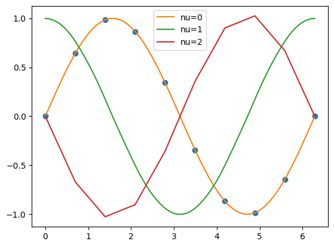

# スプライン補間【1次元】

torchにはデフォルトでスプライン補間の実装がないなあと思い、自分で実装してみることにした。
正直こういったものは今だとLLMが勝手に実装を済ませてくれるものではある気がするので、どれくらい理論まで把握しておくべきかは悩ましいところではある。ただスプライン補間は基本的な数値計算の手法であるし、自分で実装してみることで理解を深めることが出来るので、一度はやってみるのも悪くはないかな、といったところ。
しょっぱなでtorchの話を書いたが、この記事ではnumpyとscipyのみを使ってスプライン補間を実装することにする。

<!-- more -->

この記事を書くにあたっては以下のサイト・本を参考にさせていただいた。

* [https://www.mk-mode.com/rails/docs/INTERPOLATION_SPLINE.pdf](https://www.mk-mode.com/rails/docs/INTERPOLATION_SPLINE.pdf)
* [齊藤宣一 数値解析入門](https://www.utp.or.jp/book/b306462.html)

## スプライン補間の理論

スプライン補間は与えられたデータ点を通る滑らかな曲線を求める手法である。
データ点として$(x_{0}, y_{0}), (x_{1}, y_{1}), ..., (x_{m}, y_{m})$が与えられたとき、
これらを通る曲線を求めることを考える。
スプライン補間では特に各小区間$[x_{i}, x_{i+1}]$での局所的な関数を求め、さらにそれらが境界で滑らかに接続することを求めるものである。
局所的な関数として特に3次の多項式が頻繁に用いられる。
本記事ではこの3次スプライン補間について考える。

$[x_{i}, x_{i+1}]$の関数が以下の3次関数で与えられるとする。
$$
S_{i}(x) = a_{i}(x-x_{i})^{3} + b_{i}(x-x_{i})^{2} + c_{i}(x-x_{i}) + d_{i}
$$
また各$i=0,...,m-1$で制約条件がある。

* 0次の連続性: $S_{i}(x_{i+1}) = S_{i+1}(x_{i+1})$
* 1次の連続性: $S_{i}'(x_{i+1}) = S_{i+1}'(x_{i+1})$
* 2次の連続性: $S_{i}''(x_{i+1}) = S_{i+1}''(x_{i+1})$

境界条件として次を考えよう。

* 自然境界条件: $S_{0}''(x_{0}) = S_{m-1}''(x_{m}) = 0$

これらの条件を満たすように係数$a_{i}, b_{i}, c_{i}, d_{i}$を求めることがスプライン補間の目的である。
ここで$i=0,...,m-1$で$S_{i}''(x_{i})=v_{i}$と置くことにする。この$v_{i}$で各係数を表現することが出来る。

* $S_{i}''(x)=6a_{i}(x-x_{i}) + 2b_{i}$であるから、$v_{i}=2b_{i}$となる。
* 2次の連続性から、$6a_{i}(x_{i+1}-x_{i})+2b_{i}=v_{i+1}$である。整理すると、$b_{i}=\frac{v_{i+1}-v_{i}}{2(x_{i+1}-x_{i})}$となる。
* $S_{i}(x_{i})=y_{i}$であるから、$d_{i}=y_{i}$となる。
* 0次の連続性から、$a_{i}(x_{i+1}-x_{i})^{3} + b_{i}(x_{i+1}-x_{i})^{2} + c_{i}(x_{i+1}-x_{i}) + d_{i}=y_{i+1}$である。整理すると、$c_{i}=\frac{y_{i+1}-y_{i}}{x_{i+1}-x_{i}} - \frac{1}{6}(x_{i+1}-x_{i})(v_{i+1}+2v_{i})$となる。

以上から、$v_{i}$から$a_{i}, b_{i}, c_{i}, d_{i}$を求めることが出来ることが分かった。最後に$v_{i}$を求めるために、1次の連続性の条件を用いよう。
$$
3a_{i}(x_{i+1}-x_{i})^{2} + 2b_{i}(x_{i+1}-x_{i}) + c_{i} = c_{i+1}
$$
に$a_{i},b_{i},c_{i}$を代入して整理すると、
$$
(x_{i+1}-x_{i})v_{i} + 2(x_{i+2}-x_{i})v_{i+1} + (x_{i+2}-x_{i+1})v_{i+2}= 6\left(\frac{y_{i+2}-y_{i+1}}{x_{i+2}-x_{i+1}} - \frac{y_{i+1}-y_{i}}{x_{i+1}-x_{i}}\right)
$$
が得られる。
簡単のために$i=0,...,m-1$で$h_{i}=x_{i+1}-x_{i}$と、$i=1,...,m-1$で$w_{i}=6\left[(y_{i+1}-y_{i})/h_{i}-(y_{i}-y_{i-1})/h_{i-1}\right]$とおくことにすると、
$$
h_{i}v_{i} + 2(h_{i}+h_{i+1})v_{i+1} + h_{i+1}v_{i+2} = w_{i+1}
$$
が$i=1,...,m-1$で成り立つ。これは連立方程式として解くことが出来る。しかもこれは3重対角の行列の形で表すことが出来るので、Thomasのアルゴリズムを用いて$O(m)$で解くことが出来る。

## スプライン補間の実装

上記の理論を元にスプライン補間を実装してみる。
以下のコードはnumpyとscipyのみを使ってスプライン補間を実装したものである。
3重対角の行列はscipyの`solve_banded`を用いて解くことが出来る。

```python
import numpy as np
from scipy.linalg import solve_banded

class CubicSpline1D:
    """Cubic spline interpolation in 1D."""
    def __init__(self, xs: np.ndarray, ys: np.ndarray, v0: float = 0.0, vN: float = 0.0) -> None:
        """Initialize the cubic spline interpolation.
        
        Args:
            xs: x coordinates of the data points, shape = (n_points,)
            ys: y coordinates of the data points, shape = (n_points,)
            v0: derivative at the first data point
            vN: derivative at the last data point
            
        Note:
            The data points must be sorted in ascending order of x.
        """
        self.xs = xs
        self.ys = ys
        self.n_points = len(xs)
        assert self.n_points == len(ys), "xs and ys must have the same length"
        self._solve(v0, vN)
    
    def _solve(self, v0: float, vN: float) -> None:
        hs = np.diff(self.xs) # h_{i} = x_{i+1} - x_{i}, shape = (n_points - 1,)
        ys_dash = np.diff(self.ys) / hs # y'_{i} = (y_{i+1} - y_{i}) / h_{i}, shape = (n_points - 1,)
        ws = 6 * np.diff(ys_dash) # w_{i} = 6(y'_{i+1} - y'_{i}), shape = (n_points - 2,)
        # boundary conditions
        ws[0] -= hs[0] * v0
        ws[-1] -= hs[-1] * vN
        # tridiagonal matrix setup
        tridiag = np.zeros((3, self.n_points-2))
        tridiag[0, 1:] = hs[1:-1]
        tridiag[1] = 2 * (hs[:-1] + hs[1:])
        tridiag[2, :-1] = hs[1:-1]
        # solve
        self.vs = solve_banded((1, 1), tridiag, ws)
        self.vs = np.concatenate([[v0], self.vs, [vN]]) # shape = (n_points,)
        # compute coefficients
        self.coeff_a = np.diff(self.vs) / (6 * hs)
        self.coeff_b = 0.5 * self.vs[:-1]
        self.coeff_c = ys_dash - hs * (2 * self.vs[:-1] + self.vs[1:]) / 6
        self.coeff_d = self.ys[:-1]
    
    def __call__(self, x: float, nu: int = 0) -> float:
        """Evaluate the cubic spline interpolation.
        
        Args:
            x: x coordinate to evaluate the interpolation
            nu: order of derivative to evaluate (0, 1, or 2)
            
        Returns:
            The value of the cubic spline interpolation at x.
        """
        sorter = np.argsort(self.xs)
        i = np.searchsorted(self.xs, x, sorter=sorter) - 1
        i = np.clip(i, 0, self.n_points - 2)
        h = x - self.xs[i]
        if nu == 0:
            return self.coeff_a[i] * h**3 + self.coeff_b[i] * h**2 + self.coeff_c[i] * h + self.coeff_d[i]
        elif nu == 1:
            return 3 * self.coeff_a[i] * h**2 + 2 * self.coeff_b[i] * h + self.coeff_c[i]
        elif nu == 2:
            return 6 * self.coeff_a[i] * h + 2 * self.coeff_b[i]
        else:
            raise ValueError("nu must be 0, 1 or 2")
    
    def __str__(self):
        return f"CubicSpline1D(n_points={self.n_points})"
    
    def __repr__(self):
        return str(self)
```

### 使用例

```python
# sample data
xs_data = np.linspace(0, 2 * np.pi, 10)
ys_data = np.sin(xs_data)

# interpolation
interpolator = CubicSpline1D(xs_data, ys_data, 0.0, 0.0)
xs = np.linspace(0, 2 * np.pi, 100)
ys = interpolator(xs)

# plot
import matplotlib.pyplot as plt
plt.plot(xs_data, ys_data, 'o')
for nu in range(3):
    plt.plot(xs, interpolator(xs, nu), label=f"nu={nu}")
plt.legend()
plt.show()
```



