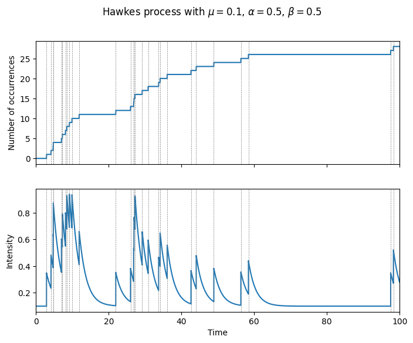

# ホークス過程

<!-- more -->

## ホークス過程とは

## Pythonによる実装
ホークス過程において、時刻$t$における強度$\lambda_t$は以下のように定義される。
$$
\lambda_t = \mu + \sum_{t_i < t} g(t - t_i)
$$
ここで、$\mu$はベースライン強度、$g(t)$はカーネルと呼ばれる関数である。カーネルは時刻$t$における過去のイベントの影響を表す。カーネルは非負である必要がある。また、カーネルは指数カーネル、べき乗カーネル、ガウスカーネルなどがある。

```python
import numpy as np
import polars as pl
import dataclasses

@dataclasses.dataclass
class Hawkes:
    mu: float
    kernel_fn: Callable[[float, np.ndarray], float]
    
    def lambda_fn(self, t, time_occurrences) -> float:
        return self.mu + self.kernel_fn(t, time_occurrences).sum()
    
    def run(self, t_max, dt, seed=None):
        time_occurrences = []
        lambda_ts = []
        if seed is not None:
            np.random.seed(seed)
        ts = np.arange(0, t_max, dt)
        for t in ts:
            lambda_t = self.lambda_fn(t, time_occurrences)
            lambda_ts.append(lambda_t)
            if np.random.rand() < lambda_t * dt:
                time_occurrences.append(t)
        return (
            pl.DataFrame({'time': ts, 'lambda': lambda_ts})
            .with_columns(pl.col('time').is_in(time_occurrences).alias('occurrence'))
            .with_columns(pl.col('occurrence').cum_sum().alias('count'))
        )
```

ここでは指数カーネル$g(t)=\alpha\beta e^{-\beta t}$を用いよう。

```python
alpha = 0.5
beta = 0.5
def exp_fn(t, ts):
    return alpha * beta * np.exp(-beta * (t - ts)).sum()
hawkes = Hawkes(0.1, exp_fn)

df = hawkes.run(t_max=100.0, dt=0.001, seed=42)
```

結果はデータフレームに保管するようにしている。これをプロットしよう。
```python
fig, axes = plt.subplots(2, 1, figsize=(8, 6), sharex=True)
axes[0].set_xlim(0, t_max)
axes[0].step(df['time'], df['count'], where='post')
for t in df.filter(pl.col('occurrence'))['time']:
    axes[0].axvline(t, color='gray', linestyle='--', linewidth=0.5)
axes[0].set_ylabel('Number of occurrences')
axes[1].set_xlim(0, t_max)
axes[1].plot(df['time'], df['lambda'])
for t in df.filter(pl.col('occurrence'))['time']:
    axes[1].axvline(t, color='gray', linestyle='--', linewidth=0.5)
axes[1].set_xlabel('Time')
axes[1].set_ylabel('Intensity')

fig.suptitle('Hawkes process with $\mu = {}$, $\\alpha = {}$, $\\beta = {}$'.format(hawkes.mu, alpha, beta))
plt.show()
```


## まとめ

実データをホークス過程にフィッティングする際には最尤推定等の推定手法を用いるそうなので、
そのあたりの実装もしてみたい。
