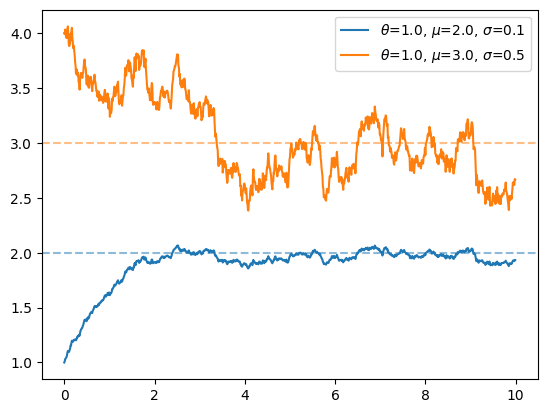
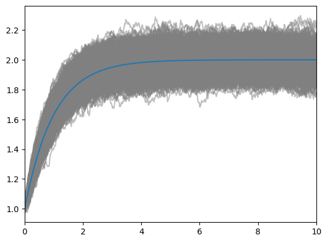

オルンシュタイン-ウーレンベック過程の基本的な性質を振り返り、
python(diffrax)で数値計算を行う。

## オルンシュタイン-ウーレンベック過程
オルンシュタインウーレンベック過程はもとをたどればブラウン運動を記述するランジュバン方程式になるだろう。
ランジュバン方程式は速度に比例する摩擦力と外部からの揺動力を受ける粒子の速度を記述する方程式である。
これを確率微分方程式の形で書き下したものが**オルンシュタイン-ウーレンベック過程**である。

$$
dx_t = \theta(\mu - x_t)dt + \sigma dW_t
$$

### 解く
定数変化法を利用する。$x_{t}e^{\theta t}$を微分すると、
$$
d(x_{t}e^{\theta t})=e^{\theta t}dx_t+\theta e^{\theta t}x_t dt
=\theta\mu e^{\theta t}dt+\sigma e^{\theta t}dW_t
$$
である。これを積分すると、
$$
x_{t}e^{\theta t}=x_0+\mu(e^{\theta t}-1)+\sigma\int_0^t e^{\theta s}dW_s
$$
である。両辺を$e^{\theta t}$で割ると、
$$
x_t = x_0 e^{-\theta t} + \mu (1 - e^{-\theta t})+\sigma\int_0^t e^{\theta (s-t)}dW_s
$$
が得られる。

この解の期待値と共分散は次のようになる。
$$
\begin{align*}
&\mathbb{E}[x_t] = x_0 e^{-\theta t} + \mu (1 - e^{-\theta t}),\\\\
&\mathrm{cov}(x_t,x_s) = \frac{\sigma^2}{2\theta}e^{-\theta(t+s)}(e^{2\theta\min(t,s)}-1)
\end{align*}
$$
特に分散は$t=s$とすることで$\sigma^{2}(1-e^{-2\theta t})/2\theta$が得られる。

### Fokker-Planck方程式
オルンシュタイン-ウーレンベック過程の確率微分方程式をFokker-Planck方程式の形に書き下すと次のようになる。
$$
\frac{\partial f}{\partial t}+\theta\frac{\partial}{\partial x}\left[(\mu - x) f\right]=\frac{\sigma^2}{2}\frac{\partial^2 f}{\partial x^2}
$$
ここで$f(x,t)$は時刻$t$における$x$の確率密度関数である。
この偏微分方程式の解は次で表される。
$$
f(x,t)=\sqrt{\frac{\theta}{\pi \sigma^2(1-e^{-2\theta t})}}\exp\left[-\frac{\theta}{\sigma^2}\frac{[x-(x_0 e^{-\theta t} + \mu (1 - e^{-\theta t}))]^2}{1-e^{-2\theta t}}\right]
$$
すなわち、時刻$t$における粒子が$\mathcal{N}(x_0 e^{-\theta t} + \mu (1 - e^{-\theta t}),\sigma^2(1-e^{-2\theta t})/2\theta)$の正規分布となることを示している。
この結果は確率微分方程式を解いた結果とも整合する。

## 数値計算
博士課程のときはjaxで微分方程式を解くことが多かった。
特にdiffraxは微分方程式のソルバーが多く実装されており、便利な上に勉強になることも多かった。
ここでもdiffraxでオルンシュタイン-ウーレンベック過程を実装してみたいと思う。

```python
from jax import random, vmap
import jax.numpy as jnp
from diffrax import diffeqsolve,  ControlTerm, Euler, MultiTerm, ODETerm, SaveAt, VirtualBrownianTree

t0, t1, dt = 0, 10, 0.01
ts = jnp.arange(t0, t1, dt)

# args = [theta, mu, sigma]
drift = lambda t, y, args: args[0] * (args[1] - y)
diffusion = lambda t, y, args: args[2]
solver = Euler()
saveat = SaveAt(ts=ts)

def solveOU(y0, args, seed):
    bm = VirtualBrownianTree(t0, t1, tol=1e-3, shape=(), key=random.PRNGKey(seed))
    terms = MultiTerm(ODETerm(drift), ControlTerm(diffusion, bm))
    sol = diffeqsolve(terms, solver, t0, t1, dt0=dt, y0=y0, saveat=saveat, args=args)
    return sol.ys
solveOU = vmap(solveOU, in_axes=(None, None, 0))
```
こちらで最低限の準備は完了である。`solveOU`関数に色々な値を入れて遊んでみよう。

```python
import matplotlib.pyplot as plt
init_args_lst = [
    [1.0, [1.0, 2.0, 0.1]],
    [4.0, [1.0, 3.0, 0.5]]
]
colors = ['tab:blue', 'tab:orange']
for i, (init, args) in enumerate(init_args_lst):
    ys = solveOU(init, args, jnp.arange(1))
    plt.plot(ts, ys.transpose(), label=rf'$\theta$={args[0]}, $\mu$={args[1]}, $\sigma$={args[2]}', color=colors[i])
    plt.axhline(args[1], color=colors[i], alpha=0.5, ls='dashed')
plt.legend()
```

いずれのパラメータの場合にも時間がたつと$\mu$付近を動くことを確認できよう。
また、$\sigma$が大きくなるとその揺らぎが大きくなっていることも確認できる。

最後に、適当な時刻において平均と分散が理論と一致することを確認しよう。
```python
n_seed = 1000
y0 = 1.0
args = [1.0, 2.0, 0.1]
sols = solveOU(y0, args, jnp.arange(n_seed))
plt.xlim(t0, t1)
for sol in sols:
    plt.plot(ts, sol, color='gray', alpha=0.5)
plt.plot(ts, y0 * jnp.exp(-args[0] * ts) + args[1] * (1 - jnp.exp(-args[0] * ts)))
```


```python
mean_fn = lambda x0, theta, mu, t: x0 * jnp.exp(-theta * t) + mu * (1 - jnp.exp(-theta * t))
var_fn = lambda theta, sigma, t: sigma * sigma * (1 - jnp.exp(-2*theta * t)) / 2 / theta
print(f'mean: theory = {mean_fn(y0, args[0], args[1], ts[100]):.6f}, experiment = {sols[:,100].mean():.6f}')
print(f'var : theory = {var_fn(args[0],args[2], ts[100]):.6f}, experiment = {sols[:,100].var():.6f}')
```
```bash
mean: theory = 1.632121, experiment = 1.637831
var : theory = 0.004323, experiment = 0.004540
```
理論値と実験値がかなり良い一致を見せていることが確認できた。

## まとめ
オルンシュタイン-ウーレンベック過程の基本的な性質を振り返り、
python(diffrax)で数値計算を行った。
確率微分方程式と久しぶりに触れ合って心地よかった。
もう少しほかの確率微分方程式とも遊んでみようかな、と思った。