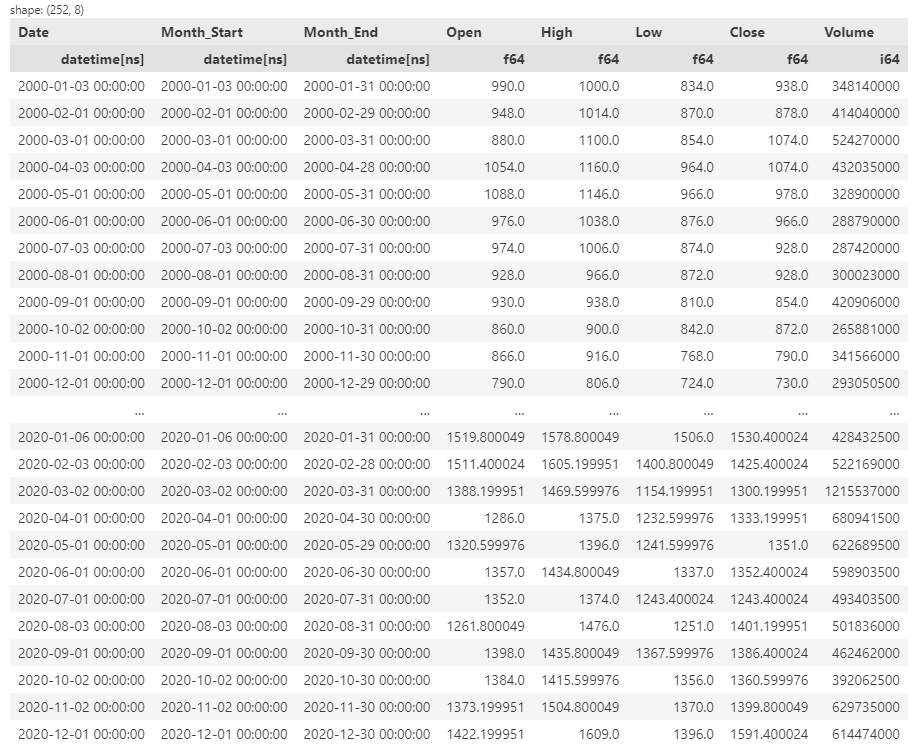
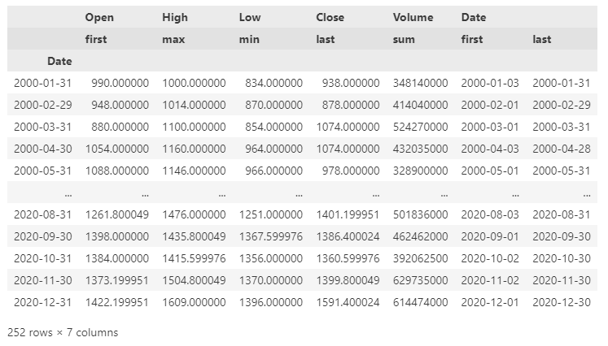
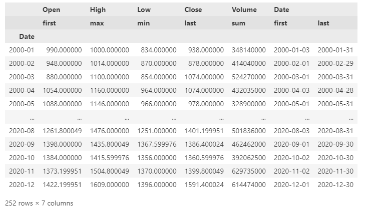

# Polarsの`group_by_dynamic`が便利

Polarsの`group_by_dynamic`[^ref]が便利だったので紹介する。というかPolarsが便利。

<!-- more -->

## Polars

株価のデータの日次データを月次データに変換するコードを例にする。
```python
import yfinance as yf
import polars as pl

df_pandas = yf.download('7203.T', start="2000-01-01", end="2020-12-31").reset_index()
(
    pl.DataFrame(df_pandas).sort('Date')
    .group_by_dynamic(index_column='Date', every='1mo', label='datapoint')
    .agg([
        pl.col('Date').first().alias('Month_Start'),
        pl.col('Date').last().alias('Month_End'),
        pl.col('Open').first(),
        pl.col('High').max(),
        pl.col('Low').min(),
        pl.col('Close').last(),
        pl.col('Volume').sum()
    ])
    # .drop(columns=['Date'])
)
```


`label='datapoint'`の引数を指定することで、indexに指定した`Date`の中に存在する値の中で初出の値を利用していることが確認できる。個人的にはpandasで実装していたときに欲しかった機能だったので嬉しい。今回の場合は`Month_Start`と`Month_End`のcolumnを作成しているので`.drop(columns=['Date'])`することになるので関係ないかもだが。

## Pandas

別にpandasでもできるけど、ダブルコラムになったりして面倒だったりする(と私は思っている)。
あと、pandasの`agg`の使い方が少しわかりづらいな、とも思っている。
```python
(
    df_pandas
    .groupby(pd.Grouper(key='Date', freq='M'))
    .agg({
        'Open': 'first',
        'High': 'max',
        'Low': 'min',
        'Close': 'last',
        'Volume': 'sum',
        'Date': ['first', 'last']
    })
)
```

このように、indexが`Date`になっているが、このindexは月終わりの日付になっている。実際にはこの日が土日になったりするので、`Date`の`last`とはずれることがある。実際には`reset_index`等を呼び出してindex周りの整理をすることになると思う。このあたりはPolarsの方が好みだな、と感じている。そもそもPolarsにはindexがないので、このような問題は起こらない。また、ダブルコラムに対応するために、column周りの整理も行うことになる。このあたりもPolarsでは`.alias('hoge')`で簡単に処理ができるのが嬉しい。

ちなみにpandasの`groupby`の引数に`df_pandas['Date'].dt.to_period('M')`を指定すると、indexを月次にすることができる。polarsには`to_period`のようなメソッドはないのが残念ではある。
```python
(
    df_pandas
    .groupby(df_pandas['Date'].dt.to_period('M'))
    .agg({
        'Open': 'first',
        'High': 'max',
        'Low': 'min',
        'Close': 'last',
        'Volume': 'sum',
        'Date': ['first', 'last']
    })
)
```


## まとめ
今年はpandasからpolarsに改宗します。

[^ref]: [https://docs.pola.rs/py-polars/html/reference/dataframe/api/polars.DataFrame.group_by_dynamic.html](https://docs.pola.rs/py-polars/html/reference/dataframe/api/polars.DataFrame.group_by_dynamic.html)