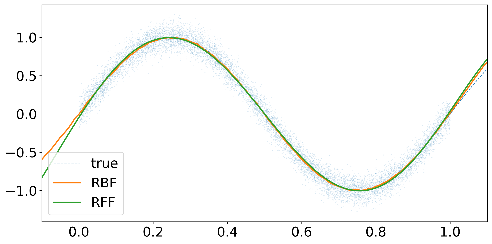

カーネル法によるリッジ回帰は表現力が高いことが知られており、またその数学的背景の豊かさから多くの研究がなされてきました。
しかし、$n$個のデータ数に対して推論に$\mathcal{O}(n^{3})$の計算量が必要とされるため、計算量を低減させる方法を検討することは非常に重要です。
ここでは、Random Fourier Features [^rff]と呼ばれる方法を紹介します。
実装も行ったが[Gist](https://gist.github.com/yonesuke/ebc5a69d270cf2cbc559ce228370f910)にも公開している。

<!-- more -->

## Random Fourier Features
Random Fourier Featuresはカーネル関数$k(x,y)\colon\mathbb{R}^{d}\times\mathbb{R}^{d}\to\mathbb{R}$が$x-y$の関数$\phi(x-y)$で表現できる場合に、それをランダムな基底で近似する手法である。キモとなるのはBochnerの定理である。


$k(x,y)=\phi(x-y)$が連続な正定値カーネルであるための必要十分条件は$\mathbb{R}^{d}$上の有限非負Borel測度$\mu$があって、
$$
k(x,y)=\int_{\mathbb{R}^{d}}e^{i\omega^{\top}(x-y)}\mathrm{d}\mu(\omega)
$$
で表されることである。


適当にスケールすれば$\mu$は確率になり、(存在すれば)$\mathrm{d}\mu(\omega)=p(\omega)\mathrm{d}\omega$と書くことが出来る。
このとき、$k$の値域は実数であるので、
$$
k(x,y)=\mathbb{E}_ {\omega}[\cos(\omega^{\top}(x-y))]
$$
実はこれは$b$を$[0,2\pi)$上の一様乱数として、
$$
2\mathbb{E}_ {\omega,b}[\cos(\omega^{\top}x+b)\cos(\omega^{\top}y+b)]
$$
と一致することがわかる。(加法定理を用いよ)


カーネル関数$k(x,y)$が$x-y$の関数で与えられるとき、
$$
k(x,y)=2\mathbb{E}_ {\omega,b}[\cos(\omega^{\top}x+b)\cos(\omega^{\top}y+b)]
$$
が成立する。ここで、$\omega$は$k$の確率に従い、$b$は$[0,2\pi)$上の一様分布に従う。


この性質を用いてカーネル関数を近似することを考える。$\omega_{i},b_{i}$をそれぞれの分布に従う乱数として$m$個発生させ、関数$z_{i}(x)=\sqrt{2/m}\cos(\omega_{i}^{\top}x+b_{i})$を構成したとき、
$$
\sum_{i=1}^{m}z_{i}(x)z_{i}(y)\to k(x,y)
$$
が$m\to\infty$の極限で大数の法則により収束していく。

## Kernel Ridge Regression
Random Fourier Featuresを用いてカーネル関数を表現することによってカーネルリッジ回帰の計算量が低減される。

データ$\mathcal{D}=\\{(x_{i},y_{i})\\}_ {i=1}^{n}$が与えられる場合を考える。入力$x_{i}$を特徴写像$\Phi$で写し、写した先の空間$H$でリッジ回帰をする。
損失関数は
$$
L=\sum_{i=1}^{n}[y_{i}-f(x_{i})]^{2}+\lambda\||f\||^{2}_ {H}
$$
となり、これを最小化する$f\in H$を探す。$\lambda\||f\||^{2}_ {H}$は正則化の項である。
Representation定理により$f$は$\Phi(x_{i})$で展開されることがわかり、色々計算すると損失関数を最小化する$\hat{f}$は
$$
\hat{f}(x)=\sum_{i=1}^{n}\hat{\alpha}\_{i}k(x_{i},x)
$$
となることがわかる。ここで、$\hat{\alpha}=(K+\lambda I_{n})^{-1}y,[K]\_{ij}=k(x_{i},x_{j})$である。
$\alpha$の計算に逆行列が含まれるため$\mathcal{O}(n^{3})$の計算量が必要となってしまう。

ここで、Random Fourier Featuresを用いてカーネル関数を近似することを考える。
共分散行列は$[Z]\_{ij}=z_{j}(x_{i})$によって$K=ZZ^{\top}$で展開されるので、
$$
\begin{align*}
\hat{f}(x)=&\sum_{i=1}^{n}\sum_{j=1}^{m}[(K+\lambda I_{n})^{-1}y]\_{i}z_{j}(x_{i})z_{j}(x)\\\\
=&\sum_{i=1}^{n}\sum_{j=1}^{m}\left[\left(ZZ^{\top}+\lambda I_{n}\right)^{-1}y\right]\_{i}[Z]\_{ij}z_{j}(x)\\\\
=&\sum_{j=1}^{m}\left[Z^{\top}\left(ZZ^{\top}+\lambda I_{n}\right)^{-1}y\right]\_{j}z_{j}(x)
\end{align*}
$$
ここでWoodburyの公式から$Z^{\top}(ZZ^{\top}+\lambda I_{n})^{-1}=(Z^{\top}Z+\lambda I_{m})^{-1}Z^{\top}$となる [^woodbury] ので、
$$
\hat{f}(x)=\sum_{j=1}^{m}\left[\left(Z^{\top}Z+\lambda I_{m}\right)^{-1}Z^{\top}y\right]\_{j}z_{j}(x)
$$
で得られる。$Z^{\top}Z$の計算に$\mathcal{O}(m^{2}n)$、$Z^{\top}Z+\lambda I_{m}$の逆行列計算に$\mathcal{O}(m^{3})$になるので、$m\ll n$ならば計算量は$\mathcal{O}(m^{2}n)$に軽減される。

## Implementation
ここではJAXを用いた実装を行う。はじめにカーネル関数のクラスを定義する。
ただし、$k\colon\mathbb{R}^{1}\times\mathbb{R}^{1}\to\mathbb{R}$のものを仮定する。
`cov_mat`関数は共分散行列を計算する関数である。`jax.vmap`を使って効率よく計算している。

```python
import jax.numpy as jnp
from jax import random, vmap, scipy
import matplotlib.pyplot as plt

class Kernel:
    def __init__(self):
        pass
    def covariance(self, x1, x2):
        raise NotImplementedError
    def cov_mat(self, xs, xs2=None):
        if xs2 is None:
            return vmap(lambda x: vmap(lambda y: self.covariance(x, y))(xs))(xs)
        else:
            return vmap(lambda x: vmap(lambda y: self.covariance(x, y))(xs2))(xs)
```

これをもとにRBFカーネルとRandom Fourier Featuresを用いた近似カーネルを定義する。
RBFカーネルは
$$
k(x,y)=\exp\left(-\frac{(x-y)^{2}}{2\sigma^{2}}\right)
$$
で定義され、Random Fourier Featuresの確率は$\mu\sim\mathcal{N}(0,1/\sigma^{2})$になる。
Random Fourier Featuresのスケールは$k(x,x)=1$なるようにすればよいが、RBFカーネルは最初からこれを満たしていることに注意する。

```python
class RadialBasisFunction(Kernel):
    def __init__(self, sigma):
        super().__init__()
        self.sigma = sigma

    def covariance(self, x1, x2):
        return jnp.exp(-jnp.sum((x1 - x2) ** 2) / (2 * self.sigma ** 2))

class RandomFourierFeature(Kernel):
    def __init__(self, n_feature, sigma, seed):
        super().__init__()
        self.n_feature = n_feature
        self.sigma = sigma
        key_w = random.PRNGKey(seed)
        self.w = random.normal(key_w, (n_feature,)) / sigma
        key_b = random.split(key_w, 1)
        self.b = random.uniform(key_b, (n_feature,)) * 2 * jnp.pi

    def z(self, x):
        return jnp.sqrt(2 / self.n_feature) * jnp.cos(self.w * x + self.b)

    def covariance(self, x1, x2):
        return jnp.dot(self.z(x1), self.z(x2))
```

カーネル関数を比較してみよう。

```python
xs = jnp.arange(-2.0, 2.0, 0.01)
sigma = 0.5

plt.figure(figsize=(24, 6))
plt.rcParams["font.size"] = 20

plt.subplot(1, 3, 1)
rbf = RadialBasisFunction(sigma)
rbf_mat = rbf.cov_mat(xs)
plt.matshow(rbf_mat, fignum=0, extent=(-2, 2, -2, 2))
plt.title("RBF")
plt.colorbar()

plt.subplot(1, 3, 2)
n_feature = 100
rff = RandomFourierFeature(n_feature, sigma, 0)
rff_mat = rff.cov_mat(xs)
plt.matshow(rff_mat, fignum=0, extent=(-2, 2, -2, 2))
plt.title(f"RFF, n_feature={n_feature}")
plt.colorbar()

plt.subplot(1, 3, 3)
n_feature = 10000
rff = RandomFourierFeature(n_feature, sigma, 0)
rff_mat = rff.cov_mat(xs)
plt.matshow(rff_mat, fignum=0, extent=(-2, 2, -2, 2))
plt.title(f"RFF, n_feature={n_feature}")
plt.colorbar()
```


特徴写像を$10^4$個も使ってみると、RBFカーネルとほぼ同じになっていることがわかる。

最後にカーネルリッジ回帰のクラスを定義する。
Random Fourier Featuresか否かで`predict`関数を分けている。

```python
class KernelRidgeRegression:
    def __init__(self, kernel: Kernel, alpha):
        self.kernel = kernel
        self.alpha = alpha

    def fit(self, xs_data, ys_data):
        self.xs_data = xs_data
        self.ys_data = ys_data
        self.K_data = self.kernel.cov_mat(xs_data)
        if self.kernel.__class__.__name__ == "RandomFourierFeature":
            Z = vmap(self.kernel.z)(xs_data)
            self.coeffs_rff = scipy.linalg.solve(Z.T @ Z + self.alpha * jnp.eye(self.kernel.n_feature), Z.T @ ys_data)
        else:
            self.coeffs = scipy.linalg.solve(self.K_data + self.alpha * jnp.eye(len(xs_data)), ys_data)

    def predict(self, xs_infer):
        if self.kernel.__class__.__name__ == "RandomFourierFeature":
            Z = vmap(self.kernel.z)(xs_infer)
            return Z @ self.coeffs_rff
        else:
            K_infer = self.kernel.cov_mat(xs_infer, self.xs_data)
            return K_infer @ self.coeffs
```

実際に回帰を行ってみよう。$10^4$個のデータを$x\mapsto\sin(2\pi x)$の関数にノイズを加えたもので生成する。

```python
n_data = 10**4
true_fn = lambda x: jnp.sin(2 * jnp.pi * x)
xs_data = random.uniform(random.PRNGKey(0), (n_data,))
ys_data = true_fn(xs_data) + random.normal(random.PRNGKey(1), (n_data,)) * 0.1
```

正則化のパラメータは$\lambda=10^{-3}$、カーネルのパラメータは$\sigma=0.5$とする。
また、Random Fourier Featuresの特徴写像は$100$個とする。

```python
sigma = 0.5
alpha = 10**-3
n_feature = 100
xs_infer = jnp.arange(-0.1, 1.1, 0.01)
# rbf
rbf = RadialBasisFunction(sigma)
rbf_regression = KernelRidgeRegression(rbf, alpha)
rbf_regression.fit(xs_data, ys_data)
ys_infer_rbf = rbf_regression.predict(xs_infer)
# rff
rff = RandomFourierFeature(n_feature, sigma, 0)
rff_regression = KernelRidgeRegression(rff, alpha)
rff_regression.fit(xs_data, ys_data)
ys_infer_rff = rff_regression.predict(xs_infer)

# plot
plt.figure(figsize=(12, 6))
plt.rcParams["font.size"] = 20
plt.xlim(-0.1, 1.1)
plt.scatter(xs_data, ys_data, s=0.1, alpha=0.2)
plt.plot(xs_infer, true_fn(xs_infer), c="tab:blue", label="true", lw=1, ls="dashed")
plt.plot(xs_infer, ys_infer_rbf, c="tab:orange", label="RBF", lw=2)
plt.plot(xs_infer, ys_infer_rff, c="tab:green", label="RFF", lw=2)
plt.legend()
```



いずれの手法も関数を回帰できていることを確認できた。
次に、データ数に対する計算時間の比較を行ってみる。

```python
import time
times_rbf, times_rff = [], []
for n_data in [10**2, 10**3, 10**4, 10**5]:
    xs_data = random.uniform(random.PRNGKey(0), (n_data,))
    ys_data = true_fn(xs_data) + random.normal(random.PRNGKey(1), (n_data,)) * 0.1
    # rbf
    start_rbf = time.perf_counter()
    rbf = RadialBasisFunction(sigma)
    rbf_regression = KernelRidgeRegression(rbf, alpha)
    rbf_regression.fit(xs_data, ys_data)
    ys_infer_rbf = rbf_regression.predict(xs_infer)
    end_rbf = time.perf_counter()
    times_rbf.append(end_rbf - start_rbf)
    # rff
    start_rff = time.perf_counter()
    rff = RandomFourierFeature(n_feature, sigma, 0)
    rff_regression = KernelRidgeRegression(rff, alpha)
    rff_regression.fit(xs_data, ys_data)
    ys_infer_rff = rff_regression.predict(xs_infer)
    end_rff = time.perf_counter()
    times_rff.append(end_rff - start_rff)
```

表にまとめると次のようになる。Random Fourier Featuresの方が計算時間が短いことがわかる。
これは一回だけの計測時間なので本当は複数回計測して平均を取った方が良いが、今回は省略する。
あとデータ数をより増やして理論予測される計算量のスケールに一致するかを比較する必要もあるが、今回は省略する。

| #data| RBF| RFF|
| ---: | --- | --- |
| $100$| 0.0351[s] | 0.0234[s] |
| $1000$| 0.0361[s] | 0.0059[s] |
| $10000$| 1.8547[s] | 0.0489[s] |
| $20000$| 11.0161[s] | 0.1733[s] |
| $30000$| 34.6534[s] | 0.4661[s] |


[^rff]: A. Rahimi, and B. Recht, "Random features for large-scale kernel machines." Advances in neural information processing systems 20 (2007). [[📁 PDF](https://proceedings.neurips.cc/paper/2007/file/013a006f03dbc5392effeb8f18fda755-Paper.pdf)]

[^woodbury]: この式自体の証明はWoodburyの公式を用いるまでもなく$Z^{\top}(ZZ^{\top}+\lambda I_{n})=(Z^{\top}Z+\lambda I_{m})Z^{\top}$からわかる。