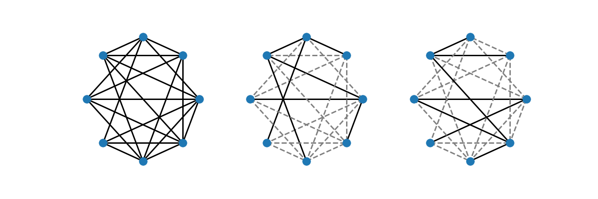
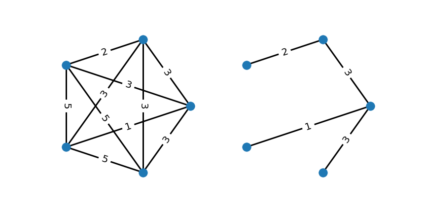

集中不等式に関する勉強をしている中でランダムグラフの最小全域木の重み和の期待値が頂点数無限の極限で$\zeta(3)$に収束するという驚異的な定理を目にしました。
今回はその定理をかんたんに紹介したいと思います。

<!-- more -->

## Minimum Spanning Tree
はじめに最小全域木についてまとめておきます。まず、[Wikipedia](https://ja.wikipedia.org/wiki/%E5%85%A8%E5%9F%9F%E6%9C%A8)によると**全域木**は

!!! note "全域木"
    グラフ$G(V,E)$において$T\subseteq E$となる辺集合$T$があるとき、グラフ$S(V,T)$が木（閉路を持たないグラフ）であるなら、$S(V,T)$のことをグラフ$G(V,E)$の全域木であるとする。

で定義されます。

例えば左端のグラフに対して、真ん中と右端のグラフ(実線が選ばれた枝に対応しています)は全域木になっています。この例からわかるように全域木は一意ではありません。

グラフの各辺に重みが与えられているときに、最小の重み和となる全域木を**最小全域木**と言います。

左のグラフのように辺重みが与えられているとき、最小全域木は右のようになります。また、そのときの重み和は$2+3+1+3=9$になります。

## Random Minimum Spanning Tree
今、各頂点が他のすべての頂点と繋がっている完全グラフを考えます。また、それぞれの枝重みは独立に$[0,1]$区間からランダムに取ることにします。
このように構成されたグラフに対して最小全域木の重み和を求めます。この重み和は頂点数が無限の極限で期待値としてどのような値を取るのでしょうか？極限では重み和は発散してしまう可能性もあります。

頂点数が$n$のときの最小全域木の重み和を$T_{n}$という確率変数で表すことにすると、実はその期待値の極限は次のように表せることが知られています。

!!! success "Theorem: Alan M. Frieze 1985 [^ref]"
    $$
    \lim_{n\to\infty}\mathbb{E}[T_{n}]=\zeta(3)
    $$

ここで、$\zeta(s)=\sum_{n=1}^{\infty}n^{-s}$は$\Re s>1$で定義されるリーマンゼータ関数です。

## Numerical Simulation

See [:simple-github: yonesuke/randomMST](https://github.com/yonesuke/randomMST) for C++ implementation.

[^ref]: Frieze, Alan M.. “On the value of a random minimum spanning tree problem.” [Discret. Appl. Math. 10 (1985): 47-56](https://www.sciencedirect.com/science/article/pii/0166218X85900587).