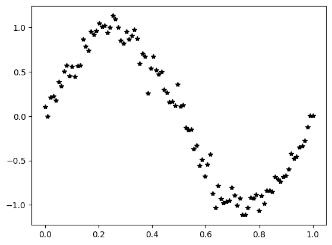
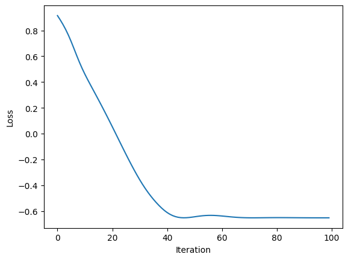
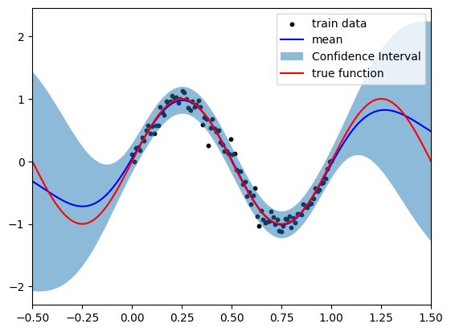

最近博士時代の研究がarxivに投稿された。ガウス過程回帰を使ってモデル方程式を学習するという内容である。
当時は`gpflow`を使っての実装を色々と行っていた記憶だが、これは名前の通り`Tensorflow`をベースとしたガウス過程ライブラリである。
ただ、最近自分自身`Pytorch`を使った実装をすることが多くなってきて、`Pytorch`をベースとしたガウス過程ライブラリである`gpytorch`を使ってみたくなった。とりあえずチュートリアルを見ながらな同じことをしてみたので備忘録的にまとめてみる。なので新しいことは何もない。

- 最近出た博士時代の研究論文: [:simple-arxiv: arXiv:2504.09110](https://arxiv.org/abs/2504.09110)
- gpytorchのチュートリアル: [GPyTorch Regression Tutorial](https://docs.gpytorch.ai/en/stable/examples/01_Exact_GPs/Simple_GP_Regression.html)

<!-- more -->

## 準備

ライブラリは`pip`でインストールできる。
```bash
pip install gpytorch
```

はじめに必要なライブラリをインポートする。
```python
import torch
import gpytorch
import matplotlib.pyplot as plt
from tqdm.auto import tqdm
```

## データの生成
これは`torch`ベースで作ればよい。

```python
def true_fn(x: torch.Tensor) -> torch.Tensor:
    return torch.sin(2 * torch.pi * x)

noise_scale = 0.1
x_train = torch.linspace(0, 1, 100)
y_train = true_fn(x_train) + noise_scale * torch.randn(x_train.size())
```


## モデルの定義

ガウス過程回帰を行うためのモデルは`gpytorch.models.ExactGP`を継承して定義する。
データが多いので補助変数法を使いたい、みたいな場合には適宜違うモデルを継承すれば良さそう。
そのあたりもいつか試してみる。
モデルの`forward`メソッドは、多変数ガウス分布を返す形になっている。

```python
class ExactGPModel(gpytorch.models.ExactGP):
    def __init__(self, train_x: torch.Tensor, train_y: torch.Tensor, likelihood: gpytorch.likelihoods.Likelihood) -> None:
        super(ExactGPModel, self).__init__(train_x, train_y, likelihood)
        self.mean_module = gpytorch.means.ConstantMean()
        self.covar_module = gpytorch.kernels.ScaleKernel(gpytorch.kernels.RBFKernel())

    def forward(self, x: torch.Tensor) -> gpytorch.distributions.MultivariateNormal:
        mean_x = self.mean_module(x)
        covar_x = self.covar_module(x)
        return gpytorch.distributions.MultivariateNormal(mean_x, covar_x)

# initialize likelihood and model
likelihood = gpytorch.likelihoods.GaussianLikelihood()
model = ExactGPModel(x_train, y_train, likelihood)
```

`gpytorch`のモデルは`torch.nn.Module`を継承しているので、`torch`のモデルと同じように使えるっぽい。
```python
isinstance(model, torch.nn.Module)  # True
```

## 学習

ガウス過程回帰は基本的に事後分布を計算するだけで、学習のステップは本来的には挟まないものである。
ただ、事前に定めるカーネルにはハイパラがあるので、それらは最適化を通して学習することが出来る。
ハイパラたちの良し悪しは、データの周辺尤度を最大化する方向に更新していくことにする。

```python
n_iter = 100 # number of iterations

model.train()
likelihood.train()
optimizer = torch.optim.Adam(model.parameters(), lr=0.1)
mll_loss = gpytorch.mlls.ExactMarginalLogLikelihood(likelihood, model) # marginal log likelihood

# training loop
losses = []
for i in tqdm(range(n_iter)):
    optimizer.zero_grad()
    output = model(x_train)
    loss = -mll_loss(output, y_train)
    loss.backward()
    optimizer.step()
    losses.append(loss.item())
```



無事に学習が進んでいるようですね。

## 予測

学習が終わったら、予測を行う。

```python
model.eval()
likelihood.eval()

with torch.no_grad(), gpytorch.settings.fast_pred_var():
    x_test = torch.linspace(-0.5, 1.5, 1000)
    observed_pred = likelihood(model(x_test))

with torch.no_grad():
    plt.xlim(x_test.numpy().min(), x_test.numpy().max())
    plt.scatter(x_train.numpy(), y_train.numpy(), c='k', s=10, label='train data')
    plt.plot(x_test.numpy(), observed_pred.mean.numpy(), 'b', label='mean')
    lower, upper = observed_pred.confidence_region()
    plt.fill_between(x_test.numpy(), lower.numpy(), upper.numpy(), alpha=0.5, label='Confidence Interval')
    plt.plot(x_test.numpy(), true_fn(x_test).numpy(), 'r', label='true function')    
    plt.legend()
    plt.show()
```



事後分布的に得られる関数系がきちんとsin関数になっていることが確認できる。
`gpytorch`を使う全体の流れが`pytorch`の流れと同じなので、`pytorch`に慣れている人はすんなりと使うことが出来そう。
